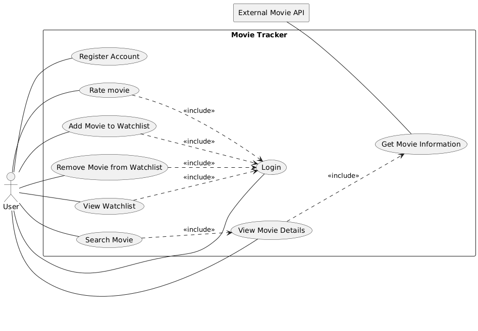

# 01 - Introduction and goals

Movie Tracker is a web application designed to help users search for movies, explore movie details, and manage a personal watchlist. The application integrates with the external TMDB (The Movie Database) API to retrieve movie information, ratings, and reviews from users who have watched the movies.

The application allows anonymous users to search for movies and access detailed movie information without authentication. However, authenticated users gain additional functionality, such as maintaining a personal watchlist where they can save and manage movies they have watched or want to watch in the future.

The primary goals of the Movie Tracker project are:

#### G1 – Easy Movie Discovery

Provide users with a simple and intuitive way to search for movies and access detailed movie information.

#### G2 – Integration with External Movie Data

Use the TMDB API as a reliable external source for:

- Movie metadata

#### G3 – Personalized Watchlist Management

Allow authenticated users to create and manage a personal watchlist of movies they have watched or plan to watch.

#### G4 – Lightweight and Maintainable Architecture

Develop a lightweight application architecture using:

- Python backend services
- SQLite database for persistence
- TanStack/React frontend for a responsive user experience

#### G5 – Public Access to Movie Information

Enable non-authenticated users to browse and explore movie information without requiring login credentials.

#### G6 – Secure User Authentication

Protect user-specific features, such as watchlist management, through user authentication and authorization mechanisms.

## 1.1 Requirements

| Id | Requirements | Explanation |
|----|--------------|---------------|
| F1 | Register Account ||
| F2 | Login ||
| F3 | Search Movie ||
| F4 | View Movie Details ||
| F5 | View Watchlist ||
| F6 | Add Movie to Watchlist ||
| F7 | Remove Movie from Watchlist ||

## 1.2 Quality goals

| Prio | Quality goals | Description |
|----|--------------|---------------|
| 1 | Usability | Users should be able to navigate and search for movies without complexity |
| 1 | Reliability | The application should consistently retrieve and display movie data |
| 2 | Maintainability | The code should remain modular and easy to extend |
| 3 | Security | User authentication and watchlist access must be protected |

## 1.3 Stakeholders

| Role | Contact | Expectations |
|----|--------------|---------------|
| End users | - | Search movies, view ratings and reviews, manage watchlists easily  |
| Developer | - |   |
| TMDB API | - | Movie tracker avoid excessive or unnecessary requests, respect rate limits and API usage policies, and ensure that API calls do not negatively impact the availability or performance of TMDB services  |
| Teacher | - |  Run the project without any issue |