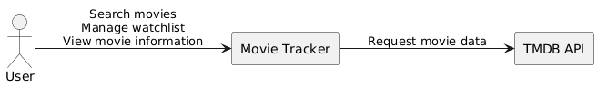

# 3 - Context and Scope

## 3.1 Business context

MovieTracker is an IMDb-inspired application focused on a smaller and more personal experience. It combines movie discovery with a watchlist and community reviews, without requiring users to leave the application for basic movie information.

The diagram shows MovieTracker as a black box. Users interact with the application to search for movies, view details, and manage their watchlists. MovieTracker retrieves the required movie data from TMDB.

The scope includes movie search, movie details, user accounts, watchlists, ratings, and reviews. Streaming, purchasing movies, and maintaining a separate movie catalogue are outside the scope; TMDB remains the source of movie metadata.

## 3.2 Technical context

The browser accesses the application through Traefik. Traefik routes page requests to the frontend and API requests to the backend. Only the backend communicates with SQLite and the external TMDB API.

| Component/Element | Description/Responsibility |
|----|--------------|
| Web Browser | User interface access through HTTPS |
| Traefik |	Reverse proxy and request routing |
| TanStack/React | Frontend user interface and client-side interactions |
| Python Backend | Business logic, authentication, API integration, watchlist management |
| SQLite Database | Persistent storage for users, watchlists, ratings, and reviews |
| TMDB API	| External provider of movie information |
| Docker |	Containerization and deployment platform |
