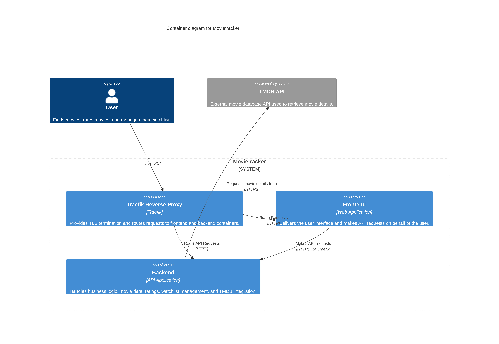

# 4 - Solution Strategy

The solution strategy summarizes the main architectural choices used to meet the functional and quality goals. MovieTracker consists of a React/TanStack frontend, a FastAPI backend, SQLite for local persistence, and TMDB as the external movie data provider.

The container diagram shows these main components and their communication paths.

| Goal / Requirement | Architectural Approach | Details |
|---|---|---|
| Lightweight backend implementation | Python FastAPI backend | The backend is implemented using Python and FastAPI to provide high performance, asynchronous request handling, and simplified API development. |
| Responsive and interactive frontend | TanStack + React | The frontend uses React and TanStack libraries to provide a modern and reactive user interface. |
| Dynamic user interaction | Single Page Application (SPA) | The frontend follows the SPA approach, loading a single HTML page and dynamically updating content through JavaScript. |
| Separation of concerns | MVC architecture | The backend follows the Model-View-Controller architectural pattern to separate business logic, data access, and request handling. |
| Lightweight persistent storage | SQLite database | SQLite is used to simplify deployment and reduce infrastructure complexity for a small-scale application. |
| External movie data integration | TMDB API integration | The backend communicates with the TMDB API to retrieve movie information. |
