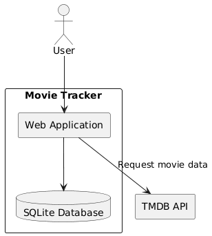
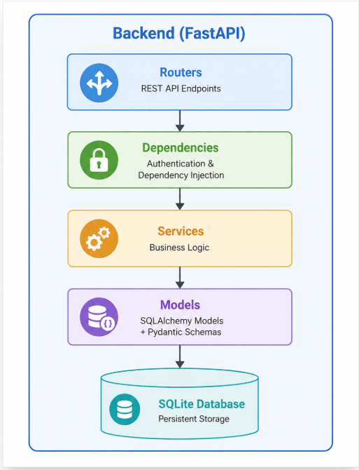
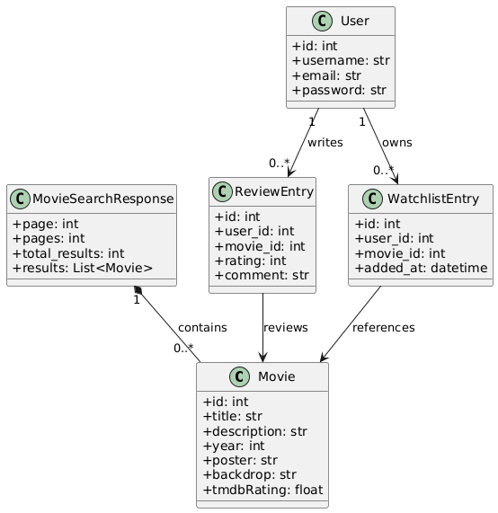

# 5 - Building Block View

## 5.1 Level 1 - Whitebox Overall System

The overall system consists of a React frontend and a FastAPI backend. The backend stores user-related data locally and retrieves movie information from TMDB.

|Building block | Description|
|-----|-----|
|**Backend**| FastAPI application written in Python 3.12. Provides REST endpoints for movie search, user authentication, watchlist management, and reviews. Integrates with the TMDB API for movie data and uses SQLAlchemy for data persistence.|
|**Frontend**| React web application built with TanStack Start, TypeScript, and Tailwind CSS. Provides the user interface for movie search, watchlist management, authentication, and reviews. Communicates exclusively with the backend through REST APIs over HTTPS.|

## 5.2 Level 2 - Backend (Whitebox)

The backend is divided into routers, dependencies, services, and models. Requests flow from the router layer to the service layer, which contains the business logic and accesses the database or TMDB when required.

## 5.2.1 Router Layer

The router layer defines the REST endpoints, validates incoming requests, and delegates processing to the appropriate services.

| Router | Prefix | Purpose |
| ----- | ----| ---|
| **movie_controller.py**     | `/api/v1/movies`    | Provides movie search and movie detail endpoints. Retrieves movie information from TMDB through the MovieService. Publicly accessible.  |
| **user_controller.py**      | `/api/v1/users`     | Handles user registration, login, logout, and retrieval of the currently authenticated user. Creates and manages JWT authentication cookies and delegates authentication operations to the UserService and TokenService. |
| **watchlist_controller.py** | `/api/v1/watchlist` | Manages user watchlists, including adding movies, removing movies, checking watchlist membership, and retrieving watchlist entries. Requires authentication. |
| **review_controller.py**    | `/api/v1/reviews`   | Provides endpoints for creating, retrieving, updating, and deleting movie reviews, as well as retrieving aggregated movie ratings. Review creation and modification require authentication.     |

## 5.2.2 Service Layer

The service layer contains the application logic and coordinates authentication, persistence, and communication with TMDB.

| Service     | Responsibility  |
|----------|--------|
| **movie_service**     | Communicates with the TMDB REST API to search movies and retrieve movie details. Implements response caching, automatic retry with exponential backoff, and maps TMDB responses to the application's internal movie models.     |
| **user_service**      | Handles user registration and authentication. Validates unique usernames and email addresses, securely hashes passwords, verifies login credentials, and resolves authenticated users from JWT access tokens.        |
| **token_service**     | Provides JWT token generation and validation. Encapsulates all authentication token creation, decoding, and verification logic.                                                                                                                                                                 |
| **watchlist_service** | Handles the business logic for managing user watchlists, including adding and removing movies, checking watchlist membership, and retrieving paginated watchlist entries.                                                                                                                                |
| **review_service**    | Manages movie reviews and ratings. Retrieves reviews and aggregated ratings, validates review eligibility, enforces one review per user and movie, requires movies to be present in the user's watchlist before review submission, and ensures that only the review owner can modify or delete a review. |

### 5.2.3 Level 3 - Data Model (Whitebox)

The database schema is defined in `backend/sqs-movietracker/models/` using SQLAlchemy declarative models. Users own watchlist and review entries, while movies are referenced by their TMDB ID.

