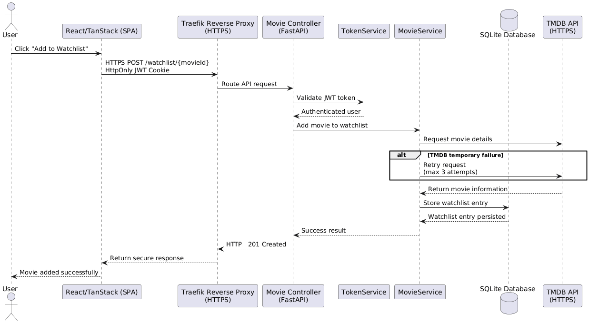
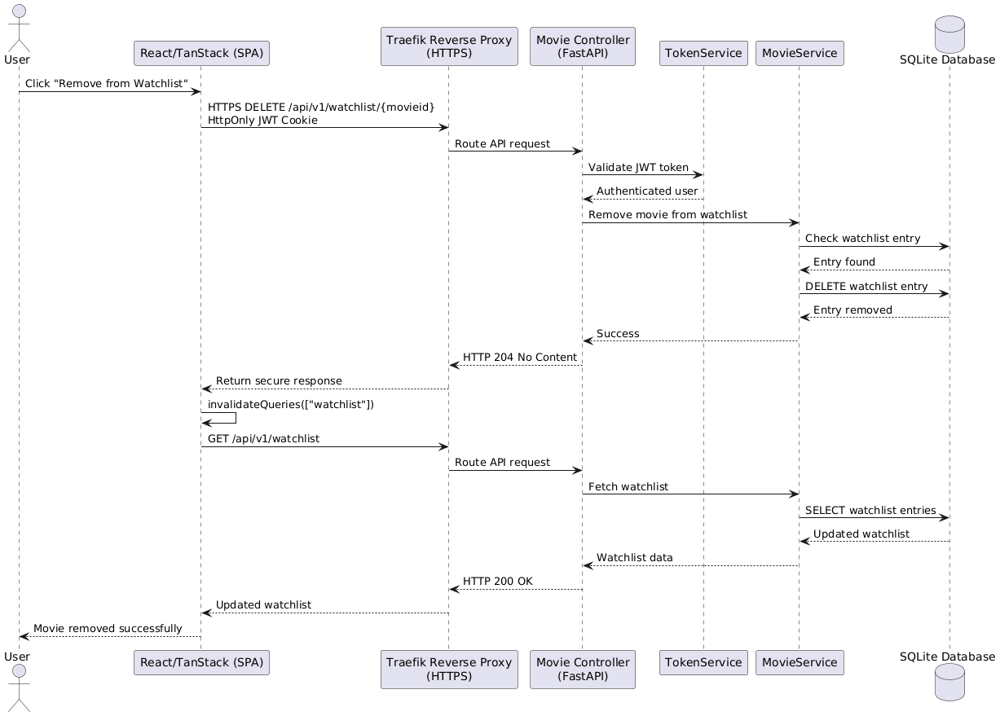
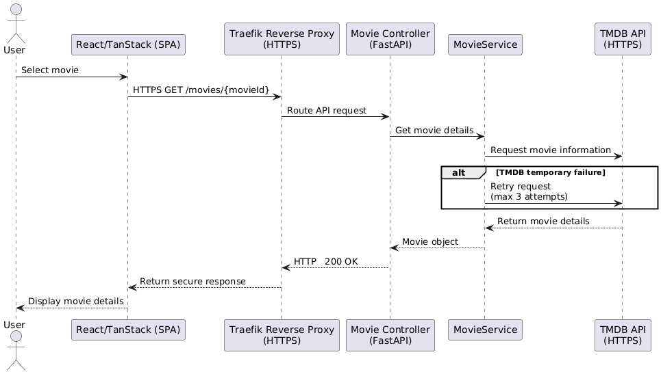

# 6 - Runtime View

The sequence diagrams show how the frontend, backend, database, and TMDB collaborate during important user actions.

## 6.1 Scenario: Add Movie to Watchlist

After authentication, the backend validates the movie through TMDB and stores a new watchlist entry in SQLite. Temporary TMDB failures are retried up to three times.

## 6.2 Scenario: Remove Movie from Watchlist

The backend verifies the authenticated user, removes the matching entry from SQLite, and returns `204 No Content`. The frontend then refreshes the displayed watchlist.

## 6.3 Scenario: View Movie Details

Movie details are requested from the backend. The backend retrieves and caches the corresponding data from TMDB before returning it to the frontend.

