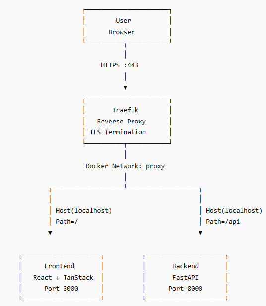

# 7 - Deployment view

## 7.1 Infrastructure overview

The application runs as three Docker containers. GitHub Actions builds and tests the frontend and backend images before publishing them to the GitHub Container Registry.

## 7.2 Container Architecture

### 7.2.1 Docker Compose Services

The docker-compose.yml defines three services :

| Service | Image/Build | Port | Purpose |
|-----|----|----| ---|
| backend | Build from  /backend/sqs-movietracker/Dockerfile | 8000 | FastAPI REST API with SQLAlchemy and SQLite|
| frontend |  Build from /frontend/sqs-movietracker/Dockerfile | 3000 | React/TanStack |
| traefik | traefik:v3.7.1 | 80 ,  443 , 8080 | Reverse Proxy |

## 7.3 Environment Configuration

The runtime configuration is loaded from a .env file located in the project's root directory. The .env.example file serves as a template.

| Variable | Required | Description |
|----------|----------|-------------|
| `TMDB_APIKEY` | Yes | API key or Read Access Token used to access the TMDB API. |
| `JWT_SECRET` | Yes | Secret key used to sign JWT tokens; automatically generated by the setup script. |
| `DATABASE_URL` | No | SQLAlchemy database URL. Defaults to `sqlite:///./test.db`. |
| `JWT_ALGORITHM` | No | JWT signing algorithm. Defaults to `HS256`. |
| `JWT_EXPIRY_MINUTES` | No | Token validity period in minutes. Defaults to `60` minutes. |

## 7.4 Network Topology

Traefik is the public entry point. It redirects HTTP to HTTPS, routes `/api` requests to the backend, and forwards all other requests to the frontend over the internal Docker network.

